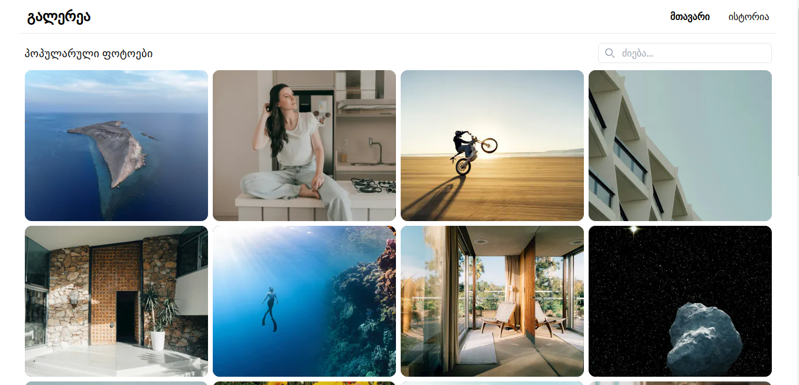
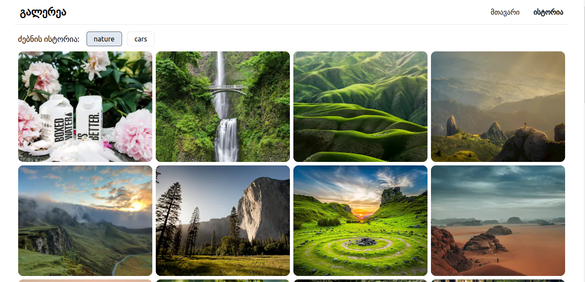
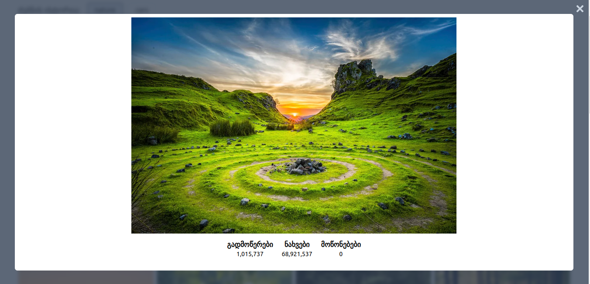

# სურათების გალერეა

ფოტოების ვებ აპლიკაცია, სადაც მომხმარებელს მთავარ გვერდზე ხვდება პოპულარული სურათები. აპლიკაციას ასევე აქვს საძიებო ველი სასურველი თემატიკის შესაბამისი ფოტოების სანახავად. ძიებისას გამოყენებულ სიტყვებთან დაბრუნება კი ისტორიის გვერდიდანაა შესაძლებელი.

## სარჩევი

1. [გამოყენებული ტექნოლოგიები](#გამოყენებული-ტექნოლოგიები)
2. [პროექტის ლოკალურად გაშვება](#პროექტის-ლოკალურად-გაშვება)
3. [საიტის ვიზუალი](#საიტის-ვიზუალი)
4. [რესურსები](#რესურსები)
5. [საიტის ლაივ მისამართი](#საიტის-ლაივ-მისამართი)

## გამოყენებული ტექნოლოგიები

- Next.js
- Typescript
- Tailwind CSS
- Zod

## პროექტის ლოკალურად გაშვება

**მიყევით შემდეგ ნაბიჯებს:**

1\. დაკლონეთ გიტჰაბ რეპოზიტორია:

```sh
git clone https://github.com/mamatsa/image-gallery.git
```

2\. დააყენეთ საჭირო ბიბლიოთეკები:

```sh
npm install
```

3\. დააკოპირეთ env.local.example ფაილი evn.local დასახელებით და ჩაწერეთ შიგნით საკუთარი Unsplash API-ს გასაღები.

```sh
cp .env.local.example .env.local
```

4\. ამის შემდეგ უკვე შეგიძლიათ პროექტის ლოკალურად გაშვება:

```sh
npm run dev
```

## საიტის ვიზუალი





## რესურსები

- [Unsplash API](https://unsplash.com/documentation)
- [გიტის კომიტების სტრუქტურა](https://gist.github.com/qoomon/5dfcdf8eec66a051ecd85625518cfd13)

## საიტის ლაივ მისამართი

- [https://image-gallery-eta-flax.vercel.app/](https://image-gallery-eta-flax.vercel.app)
